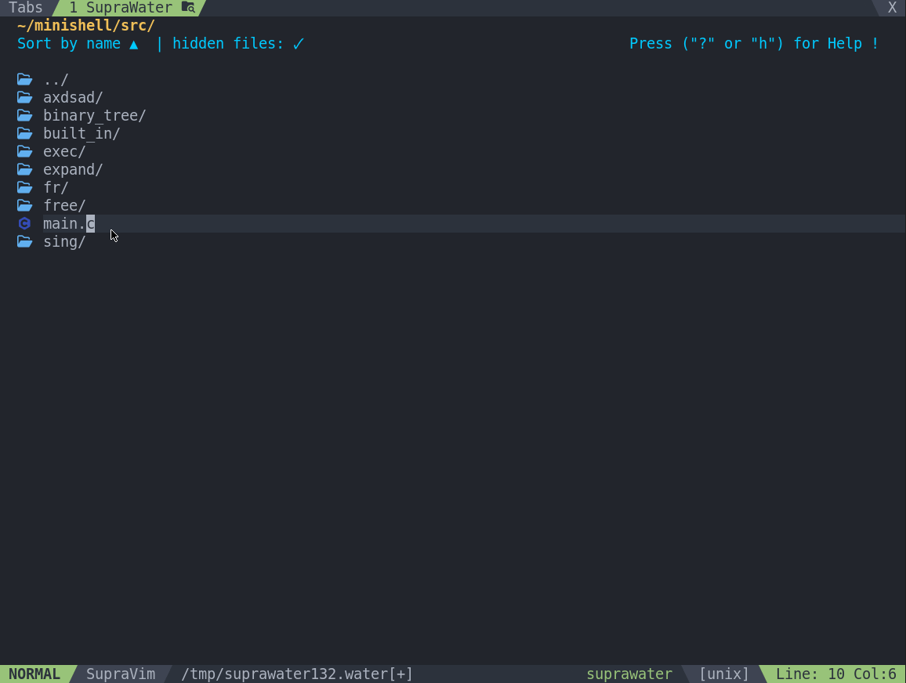

# 🌊 SupraWater

SupraWater is an interactive file explorer for Vim 9.1, written in Vim9script.
It provides an experience similar to nvim-oil, but natively for Vim.

## ✨ Features

- 📁 File system navigation
- ✍️ Direct editing of paths/files
- 🪟 Open in split / vsplit / tab
- 👁️ File preview
- ↩️ Undo / Redo actions
- 📋 Copy / Paste
- 🏠 Quick access to $HOME
- 🔍 Show hidden files
- 🔃 Ascending / descending sort
- 🎨 Icon support (vim-devicons or SupraIcons)
- 🧠 Built-in help popup

## ⚙️ Requirements

- Vim 9.1
- (Optional) SupraIcons or vim-devicons

## ⌨️ Keybindings

### Opening

- **Enter / Double click**: Open
- **Ctrl-t**: New tab
- **<Leader-h>**: Horizontal split
- **<Leader-v>**: Vertical split
- **Ctrl-p**: Preview

### Navigation / Quit

- **Ctrl-q**: Quit
- **Backspace / -**: Parent directory
- **Alt-Up / Alt-Down**: Move item
- **~**: HOME
- **_**: First path

### Editing

- **Ctrl-s**: Save
- **p**: Paste
- **dw / db**: Delete word
- **yw / yb**: Copy word
- **u**: Undo
- **Ctrl-r**: Redo

### Options

- **=**: Toggle sort order
- **g.**: Toggle hidden files
- **?**: Help

## 🔧 Configuration

| Variable | Default | Description |
| -------- | ------- | ----------- |
| g:suprawater_icons_glyph_func | 'g:WebDevIconsGetFileTypeSymbol' | Function used to get icons |
| g:suprawater_filter_files | [] | List of files to filter ['*.o', '*.tmp'] |
| g:suprawater_sortascending | true | Sort ascending by default |
| g:suprawater_show_hidden | true | Show hidden files by default |
| g:SupraWaterForceColor | '' | Force a specific color (e.g. '#RRGGBB') |
| g:SupraWaterDarkenAmount | 25 | Background darkening percentage |
